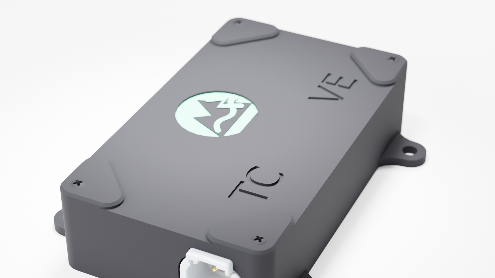

# TrailCurrent Solstice



Solar gateway module that reads data from a Victron MPPT (Maximum Power Point Tracker) solar charge controller via serial and relays the readings over a CAN bus interface. Part of the [TrailCurrent](https://trailcurrent.com) open-source vehicle platform.

## Hardware Overview

- **Board:** [Waveshare ESP32-S3-RS485-CAN](https://www.waveshare.com/wiki/ESP32-S3-RS485-CAN)
- **Microcontroller:** ESP32-S3
- **Function:** Serial-to-CAN bus bridge for Victron MPPT solar charge controller data
- **Key Features:**
  - Victron MPPT VE.Direct TEXT protocol parsing (solar data)
  - VE.Direct HEX GET polling for SmartShunt extended data (temperature, midpoint voltage, alarms, history)
  - Load control via VE.Direct HEX SET protocol over CAN
  - CAN bus output at 500 kbps
  - Real-time solar panel monitoring
  - OTA firmware updates via CAN-triggered WiFi + HTTP
  - WiFi credential provisioning over CAN bus

## Hardware Requirements

### Connections

See [DOCS/solstice-pinout.svg](DOCS/solstice-pinout.svg) for a wiring diagram of all external connections.

### Components

- **Board:** [Waveshare ESP32-S3-RS485-CAN](https://www.waveshare.com/wiki/ESP32-S3-RS485-CAN#Schematic) — [schematic](DOCS/ESP32-S3-RS485-CAN-Schematic.pdf)
- **CAN Bus:** Built-in transceiver (TX: GPIO 15, RX: GPIO 16, 500 kbps)
- **Serial:** Victron MPPT VE.Direct connection via SH1.0 4-pin JST (RX: GPIO 1, TX: GPIO 2 at 19200 baud)
- **Debug Console:** USB CDC (115200 baud)

### KiCAD Library Dependencies

This project uses the consolidated [TrailCurrentKiCADLibraries](https://github.com/trailcurrentoss/TrailCurrentKiCADLibraries).

**Setup:**

```bash
# Clone the library
git clone git@github.com:trailcurrentoss/TrailCurrentKiCADLibraries.git

# Set environment variables (add to ~/.bashrc or ~/.zshrc)
export TRAILCURRENT_SYMBOL_DIR="/path/to/TrailCurrentKiCADLibraries/symbols"
export TRAILCURRENT_FOOTPRINT_DIR="/path/to/TrailCurrentKiCADLibraries/footprints"
export TRAILCURRENT_3DMODEL_DIR="/path/to/TrailCurrentKiCADLibraries/3d_models"
```

See [KICAD_ENVIRONMENT_SETUP.md](https://github.com/trailcurrentoss/TrailCurrentKiCADLibraries/blob/main/KICAD_ENVIRONMENT_SETUP.md) in the library repository for detailed setup instructions.

## Opening the Project

1. **Set up environment variables** (see Library Dependencies above)
2. **Open KiCAD:**
   ```bash
   kicad EDA/solstice.kicad_pro
   ```
3. **Verify libraries load** - All symbol and footprint libraries should resolve without errors
4. **View 3D models** - Open PCB and press `Alt+3` to view the 3D visualization

### Schematic Sheets

The design uses a hierarchical schematic with dedicated sheets:
- **Root** - Top-level connections
- **Power** - Power distribution and regulation
- **CAN** - CAN bus transceiver interface
- **MCU** - ESP32 microcontroller and support circuits
- **Connectivity** - Serial interface to Victron MPPT

## Firmware

ESP-IDF 5.5.2 project in the `main/` directory.

**Setup:**
```bash
# Source ESP-IDF environment
source ~/esp/v5.5.2/esp-idf/export.sh

# Set target
idf.py set-target esp32s3

# Build firmware
idf.py build

# Flash to board
idf.py -p /dev/ttyUSB0 flash

# Monitor serial output
idf.py -p /dev/ttyUSB0 monitor
```

### Victron VE.Direct Parameters

The firmware parses the following VE.Direct TEXT protocol fields from the MPPT:

| Parameter | Description |
|-----------|-------------|
| V | Battery voltage |
| VPV | Panel voltage |
| PPV | Panel power (watts) |
| I | Panel current |
| CS | Charge state |
| ERR | Error code |
| H19-H23 | Historical yield and power data |

The firmware also polls the following SmartShunt registers via VE.Direct HEX GET (one every 2 seconds, ~12 s full cycle):

| Register | Description |
|----------|-------------|
| 0xEDEC | Battery temperature (0.01 K) |
| 0x0382 | Midpoint voltage (mV) |
| 0x031E | Alarm reason (bitmask) |
| 0x0300 | Deepest discharge (0.1 Ah) — H1 |
| 0x0305 | Cumulative Ah drawn (0.1 Ah) — H6 |
| 0x0303 | Charge cycles — H4 |

### CAN Bus Protocol

The gateway uses the following CAN message IDs at 500 kbps:

**Message 0x00** (3 bytes) - OTA trigger (received):

| Byte | Description |
|------|-------------|
| 0-2 | Target device MAC bytes (last 3 bytes, matched against hostname) |

Triggers the device to connect to WiFi and start an HTTP OTA server for 3 minutes. Upload firmware with:
```bash
curl -X POST http://esp32-XXYYZZ.local/ota --data-binary @build/solstice.bin
```

**Message 0x01** - WiFi credential provisioning (received):

Chunked protocol for sending WiFi SSID and password over CAN. Credentials are stored in NVS and persist across reboots. See `ota.h` for the protocol details.

**Message 0x04** (6 bytes) - Firmware version report (transmitted once on boot):

| Byte | Description |
|------|-------------|
| 0-2 | Last 3 bytes of device WiFi MAC (matches hostname `esp32-XXYYZZ`) |
| 3-5 | Semantic version: major, minor, patch |

Sent after CAN initialization. Headwaters uses this to track the running firmware version, including after OTA updates.

**Message 0x2C** (7 bytes) - Solar panel basics (transmitted every 33ms):

| Byte | Description |
|------|-------------|
| 0-1 | Panel voltage |
| 2-3 | Solar watts |
| 4-5 | Battery voltage |
| 6 | Solar status |

**Message 0x2D** (3 bytes) - Solar current:

| Byte | Description |
|------|-------------|
| 0 | Current sign |
| 1-2 | Current magnitude |

**Message 0x2E** (1 byte) - Load control (received):

| Byte | Description |
|------|-------------|
| 0 | Load state (0x00=OFF, 0x01=ON, 0x04=Default) |

When a 0x2E message is received over CAN, the gateway sends a VE.Direct HEX SET command to register 0xEDAB on the MPPT to control the load output.

**Message 0x2B** (6 bytes) - Shunt extended live data (transmitted every 33ms):

| Byte | Description |
|------|-------------|
| 0-1 | Temperature (int16 BE, centidegrees C — multiply by 0.01 for °C) |
| 2-3 | Midpoint voltage (uint16 BE, millivolts) |
| 4-5 | Alarm reason (uint16 BE, bitmask) |

**Message 0x2F** (6 bytes) - Shunt extended history (transmitted every 33ms):

| Byte | Description |
|------|-------------|
| 0-1 | Deepest discharge (uint16 BE, whole Ah) |
| 2-3 | Cumulative Ah drawn (uint16 BE, whole Ah) |
| 4-5 | Charge cycles (uint16 BE, count) |

Both shunt extended messages are populated by periodic VE.Direct HEX GET requests to the SmartShunt. Values update every ~12 seconds (6 registers polled at 2 s intervals).

## Project Structure

```
├── main/                         # ESP-IDF firmware source
│   ├── main.c                    # VE.Direct parser, CAN TX/RX, load control
│   ├── ota.h                     # OTA update and WiFi provisioning header
│   ├── ota.c                     # OTA update and WiFi provisioning
│   ├── idf_component.yml         # Managed component dependencies (mdns)
│   └── CMakeLists.txt            # Component build config
├── EDA/                          # KiCAD hardware design files
│   ├── solstice.kicad_pro
│   ├── solstice.kicad_sch        # Root schematic
│   ├── can.kicad_sch             # CAN subsystem
│   ├── connectivity.kicad_sch    # Serial interface
│   ├── mcu.kicad_sch             # MCU subsystem
│   ├── power.kicad_sch           # Power subsystem
│   └── solstice.kicad_pcb        # PCB layout
├── CAD/                          # Enclosure design
│   └── trailcurrent-solstice-housing.FCStd
├── DOCS/                         # Documentation and diagrams
│   ├── solstice-pinout.svg       # External connection diagram
│   └── ESP32-S3-RS485-CAN-Schematic.pdf
├── partitions.csv                # Dual OTA partition table
├── sdkconfig.defaults            # ESP-IDF build defaults
└── CMakeLists.txt                # ESP-IDF project config
```

## License

MIT License - See LICENSE file for details.

This is open source hardware. You are free to use, modify, and distribute these designs under the terms of the MIT license.

## Contributing

Improvements and contributions are welcome! Please submit issues or pull requests.

## Support

For questions about:
- **KiCAD setup:** See [KICAD_ENVIRONMENT_SETUP.md](https://github.com/trailcurrentoss/TrailCurrentKiCADLibraries/blob/main/KICAD_ENVIRONMENT_SETUP.md)
- **Assembly workflow:** See [BOM_ASSEMBLY_WORKFLOW.md](https://github.com/trailcurrentoss/TrailCurrentKiCADLibraries/blob/main/BOM_ASSEMBLY_WORKFLOW.md)
